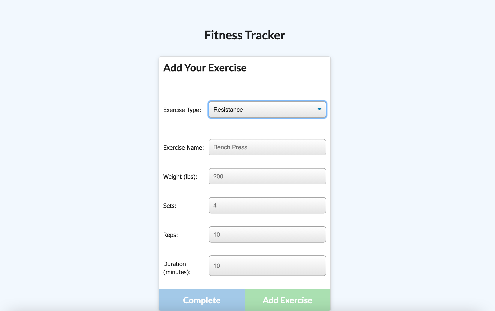

# MongoDB Workout Tracker

This application is a workout tracker that allows users to create and track daily workouts. Users can log multiple exercises in a workout on a given day, as well as track the name, type, weight, sets, reps, and duration of exercise. If the exercise is a cardio exercise, user should be able to track distance traveled.

## Installation

### To download code base:
- go to https://github.com/lizaferguson/MongoDB-Workout-Tracker
- clone code base onto local machine 
- run following commands to install node packages and initialize the server

```bash
npm i 
```
```bash
npm start
```
- navigate to localhost:[PORT] to view application

### To access deployed app on Heroku
- go to https://cryptic-mesa-08509.herokuapp.com/

## Usage

When the user loads the page, they should be given the option to create a new workout or continue with their last workout.
The user should be able to:

Add exercises to the most recent workout plan.

Add new exercises to a new workout plan.

View the combined weight of multiple exercises from the past seven workouts on the stats page.

View the total duration of each workout from the past seven workouts on the stats page.

### Below is an example image of the apps appearance:




## Contributing
Original code provided by Trilogy Education Services